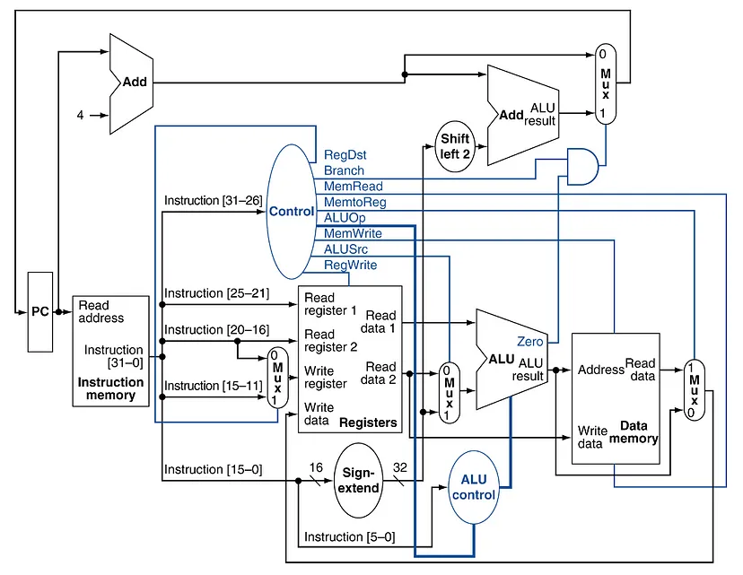

# RISC V 32-Bit CPU Emulator

 - By William Lim, Mathew Barlund

## AI Usage

 - AI was used to generate a portion of the unit tests, assisting with minor bug fixes, and for generating assembly files.

## Installation

First CD into the project directory and make sure pip and build and wheel are up to date:

```
python -m pip install --upgrade pip
python -m pip install --upgrade build wheel
```

Then build the package:

```
python -m build
```

Then install the `.whl` file in the `dist/` directory that was just created.

```
python -m pip install dist/something.whl
```

Now the cpu emulator should be installed globally!

## Running the emulator

To run a program with the emulator use the command in the terminal:

```
riskv-sim {input_file.hex or input_file.asm}
```

To see what flags you can include do:

```
riscv-sim --help
```

These flags show different debug information after each step. Here is the help command output for your convenience:

```
usage: riscv-sim {program file path}
  use --help for more information

An RV32I CPU Emulator with FPU extension. It will attempt to assemble and run the provided RV32I assembly source file on the RV32I emulator.

positional arguments:
  source                Path to input assembly or hex file.

options:
  -h, --help            show this help message and exit
  --assemble_only       Flag to assemble a file without running it.
  --dont_show_steps     Flag to not show every instruction step the emulator takes.
  --show_memory         Flag to show all the in use memory in the Memory Unit.
  --show_reads          Flag to show whenever the Memory Unit is read from.
  --show_writes         Flag to show whenever the Memory Unit is written to.
  --show_immediate_values
                        Flag to show all possible immediate values by type after every step.
  --show_registers      Flag to show all registers after every step.
  -o OUTPUT, --output OUTPUT
                        Path to output hex file. This only works when the '--assemble_only' argument flag is included
```

## Using the assembler

To just assemble an RV32I assembly program use the `--assemble_only` flag:

```
riskv-sim {input_file.asm} --assemble_only -o {outputfile.hex}
```
You should then see the output file saved to the location specified by `-o`.

## Supported Instruction Set

### R-Type
 * ADD
 * SUB
 * AND
 * OR
 * XOR
 * SLL
 * SRL
 * SRA

### I-Type
 * ADDI
 * LW
 * JALR

### B-Type
 * BEQ
 * BNE

### U-Type
 * LUI
 * AUIPC

### S-Type
 * SW

### J-Type
 * JAL

## Testing
This project contains 6 different testers to ensure each component is individually functional. These files perform unit tests, thus validating that each tested method works as intended and may be safely used.

## Architecture


This was the diagram upon which we based our designs. We used this image to help us identify which components need to be connected where as well as how to process each bit in the instructions. 
