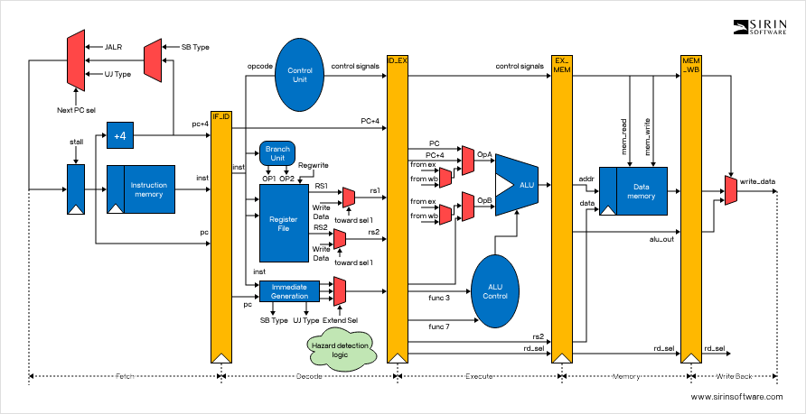

## Supported Instruction Set

### R-Type
 * ADD
 * SUB
 * AND
 * OR
 * XOR
 * SLL
 * SRL
 * SRA

### I-Type
 * ADDI
 * LW
 * JALR

### B-Type
 * BEQ
 * BNE

### U-Type
 * LUI
 * AUIPC

### S-Type
 * SW

### J-Type
 * JAL

### Floating
 * FADD
 * FSUB
 * FMUL

## Testing

This project uses the pytest testing framework to perform unit tests to test specific components of the cpu. We opted to use pytest for its convenience and its ease of use. 

## Architecture

This was the diagram upon which we based our designs. We used this image to help us identify which components need to be connected where as well as how to process each bit in the instructions. 

The layout of the datapath is as follows- instructions are fetched from the memory unit, which are then interpreted by the control unit. Next, the control unit sends signals to the appropriate components so the instruction can be executed. The registers are then queried for the data stored in a relevant register and the data is manipulated in the ALU, saving results to the appropraite register when specified. 

## Additional Features

This project also contains code to perform operations at the gate-level, the logic for which is stored in gates.py, which allows us to demonstrate more clearly what is taking place in the inside of a CPU. 
